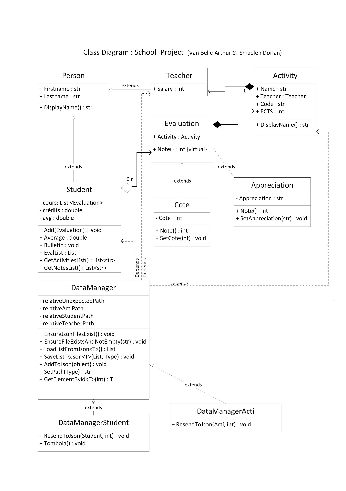
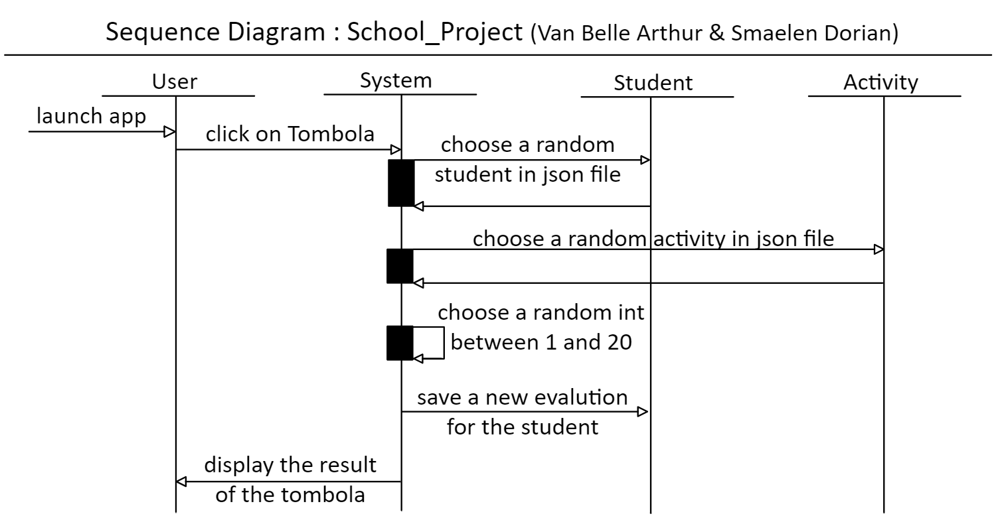

# school_project

## Rapport

### Diagramme de classe

### Diagramme de séquence

### Principes SOLID
Dans ce projet nous avons tenté d’intégrer les principes SOLID.
Nous pouvons illustrer un premier principe mis en place : Single Responsibility Principle.
Chaque classe implémentée dans ce projet n’a qu’une seule responsabilité. La classe « Person » a pour sous-classe « Teacher » et « Student », « Evaluation » a « Cote » et « Appreciation » pour sous-classes. Enfin les activités sont encore stockées dans un objet à part : « Activity ». Toutes ces classes avaient déjà été implémentées lors d’une séance de laboratoire en partie. Il restait donc à ajouter une gestion des fichiers JSON pour l’enregistrement des objets créés. Pour cela, nous avons créé la classe « DataManager » qui permet de gérer les interactions avec les fichiers JSON. Ainsi on conserve la responsabilité unique de chaque classe en n’implémentant pas cet aspect du projet dans les classes-mêmes des objets enregistrés.

Un second principe SOLID facilement illustrable : Open/Closed Principle.
Prenons l’exemple de la classe « DataManager ». A partir de cette classe on peut ajouter n’importe quel objet qui a besoin d’être enregistré dans un fichier JSON. Ceci donne donc la possibilité d’étendre le projet en créant d’autres objets à enregistrer et autant de sous-classes de « DataManager » pour les enregistrer. La classe est donc ouverte à l’extension et fermée à la modification.
